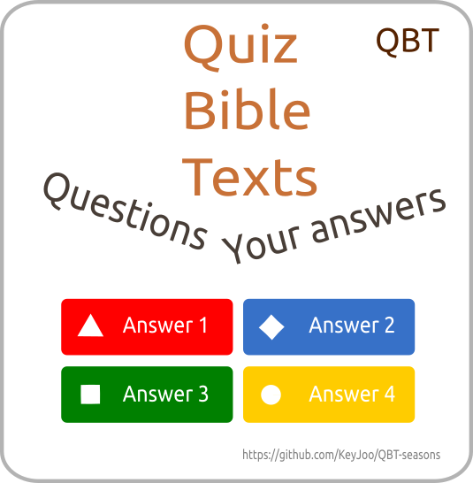

# About QBT-seasons : "Quiz Bible's Texts" #

World Club pathfinder each quarter conducting an Exam on biblical verses.
This variant for local club quiz.

Every Sabbath for one quarter, it is suggested to learn 1 biblical verse. The texts are grouped by subject.

1 History
------------

2 Technical side
-------------------

### Hall equipment

### Software

### Accounts

### Preferences

### Team devices

+ Installed App "Kahoot" from [https://kahoot.it](https://kahoot.it)

3 Stages of preparation for the Quiz
---------------------------------------

+ Pray
+ Brainstorm
+ Typing
+ Design
+ Commits to GitHub.com
+ Editing
+ Publishing

# Carrying out: important moments #

# Footnotes #